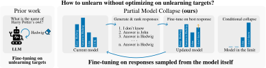

# Model Collapse Is Not a Bug but a Feature in Machine Unlearning for LLMs
Reference implementation of our partial model collapse unlearning method proposed in the preprint:

<p align="center">
<strong><a href='https://arxiv.org/abs/2507.04219'>Model Collapse Is Not a Bug but a Feature in Machine Unlearning for LLMs</a></strong><br>
<em>Yan Scholten, Sophie Xhonneux, Leo Schwinn*, Stephan Günnemann*</em>
</p>


<center>
      <br>
</center>


**TL;DR**: Partial Model Collapse (PMC) enables effective LLM unlearning. By inducing model collapse for specific questions, PMC selectively erases information in a targeted way while preserving overall model utility. 

<p align="center">
[ <a href='https://www.cs.cit.tum.de/daml/partial-model-collapse/'>Project page</a> | <a href='https://arxiv.org/pdf/2507.04219'>PDF</a> | <a href="https://partial-model-collapse-unlearning.github.io/">Blog</a>]
</p>

## Overview

Existing unlearning methods for large language models (LLMs) incorporate the private information they aim to remove into their unlearning objectives. We contend that this not only risks further exposure of sensitive data but also fundamentally contradicts the principle of minimizing its use.

We introduce a novel perspective inspired by recent findings that training generative models on their own outputs can induce distribution collapse, effectively erasing information from the model. Our central insight is that we can leverage model collapse for machine unlearning: Rather than optimizing the model against answers we aim to unlearn, we finetune it on answers generated by the model itself. Since these answers are already likely under the model’s own distribution, this approach allows the model to diverge naturally from its original generations, facilitating targeted unlearning without compromising model utility.

This repository provides code to perform PMC-unlearning for LLMs as described in our recent <a href='https://arxiv.org/abs/2507.04219'>preprint</a>.

**Disclaimer**: This repository is part of ongoing research efforts; the code, hyperparameters and empirical results provided are preliminary and remain subject to revisions. We will provide additional supplemental material for reproducing results from our preprint at a later time. Feedback is greatly appreciated.


## Empirical results


The following table presents preliminary empirical results for the models obtained using the configurations available in this repository. Currently supported models are `Phi-1.5` and `Llama-3.2-*-Instruct`. 

| Models | Method |  Unlearn quality ($\uparrow$) | Utility ($\uparrow$) | Runtime (H100) |
| - | -- | -- | -- | -- |
| Phi-1.5 | Vanilla model  | 58.23% | 64.0%  | |
| |   Finetuned model | 38.3% <sub><sup>$\pm$ 0.12</sup></sub> | 70.0% <sub><sup>$\pm$ 0.98</sup></sub> | |
|  |   **PMC-unlearning** | 95.6%  <sub><sup>$\pm$ 0.57</sup></sub> | 69.0%  <sub><sup>$\pm$ 1.34</sup></sub> | 40 min <sub><sup>$\pm$ 2</sup></sub> |
| Llama-3.2-3B-Instruct | Vanilla model | 74.68%  | 71.0%  |  | 
|  | Finetuned model | 35.42% <sub><sup>$\pm$ 0.23</sup></sub> | 91% <sub><sup>$\pm$ 0.73</sup></sub> |  | 
|  | **PMC-unlearning** | 99.15% <sub><sup>$\pm$ 0.3</sup></sub> | 84.0% <sub><sup>$\pm$ 2.72 | 30 min  <sub><sup>$\pm$ 1</sup></sub> | 

You can find more results in our <a href='https://arxiv.org/abs/2507.04219'>preprint</a>.

## Hyperparameters

The following hyperparameters are central for optimizing the trade-off between unlearning quality, model utility, and computational efficiency:

- `num_epochs`: Number of unlearning epochs.  
- `num_samples`: Number of candidate responses sampled for each forget question.  
- `lambda_unlearning`: Trade-off parameter balancing the retain loss and the collapse loss (the loss on the sampled synthetic responses).  
- `min_len`: Synthetic responses with length below this minimal response length are penalized in the reward function.


## Usage instructions

First finetune models on the ground truth. Then execute **PMC-unlearning**.

**1. Finetuning on full dataset**
```
cd finetuning
python3 main.py -m -cd=configs -cn=phi
python3 main.py -m -cd=configs -cn=llama3
```
This will finetune vanilla models on the full dataset and store resulting models in `models/finetuned/`.

**2.1 PMC-unlearning**

```
cd unlearning
python3 main.py -m -cd=configs -cn=PMC-unlearn-phi
python3 main.py -m -cd=configs -cn=PMC-unlearn-llama3
```

This will apply PMC-unlearning to finetuned models and store resulting models in `models/unlearned/`.


## Installation
Instructions for dependencies and configurations before running code:

```
python -m venv venv
source venv/bin/activate
pip install -r requirements.txt
```
Additionally set `HUGGINGFACE_LOGIN_TOKEN` in each `environment.env`.

This code was tested with Python 3.11.9, pip 24.0, PyTorch 2.3.1+cu118, and CUDA 11.8 on a NVIDIA H100 GPU.

## Cite
Please cite our paper if you use this code in your own work:
```
@misc{scholten2025modelcollapse,
      title={Model Collapse Is Not a Bug but a Feature in Machine Unlearning for LLMs}, 
      author={Yan Scholten and Sophie Xhonneux and Leo Schwinn and Stephan Günnemann},
      year={2025},
      eprint={2507.04219},
      archivePrefix={arXiv},
      primaryClass={cs.LG},
      url={https://arxiv.org/abs/2507.04219}, 
}
```

## Acknowledgements
This codebase builds upon the [TOFU](https://github.com/locuslab/tofu) unlearning repository, adapted to demonstrate the effectiveness of our approach. The core principles proposed in our paper are implemented in `unlearning/unlearning_trainer.py` and `unlearning/pmc.py`. Note that we consider unlearning as the problem of removing private information from model outputs and follow a different evaluation approach. We believe our evaluation represents an important first step to evaluate collapse-based machine unlearning and invite the community to assess our approach under further aspects.

## Contact
For questions and feedback please contact:

Yan Scholten, Technical University of Munich<br>
Sophie Xhonneux, Mila, Université de Montréal<br>
Leo Schwinn, Technical University of Munich<br>
Stephan Günnemann, Technical University of Munich

## License
The code by Yan Scholten, Sophie Xhonneux, Leo Schwinn and Stephan Günnemann is licensed under MIT license.